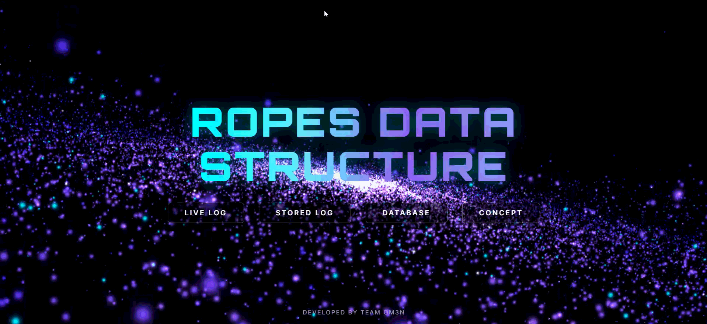

# RopeLog Engine

## Demo

A real-time log processing and visualization system built using a Treap-based Rope data structure. The system supports live log streaming, historical querying, and database-backed archival with a performant and scalable design.

---

## Overview

RopeLog Engine is designed to efficiently handle high-volume log data by leveraging a Rope-like structure implemented using a randomized balanced binary tree (Treap). It provides a responsive web interface for monitoring logs in real time and querying historical data.

---

## Key Features

- Real-time log streaming using Server-Sent Events (SSE)
- Efficient log storage using a Treap-based Rope structure
- Historical log querying with filters (date, PID, system ID)
- Database-backed archival for deleted logs
- Interactive web-based visualization dashboard
- Conceptual simulation of Rope data structure operations

---

## System Architecture

The system consists of three main components:

### 1. Backend (C++)

- Implements a Treap-based Rope structure for log storage
- Handles log ingestion from system sources (e.g., journalctl, bpftrace)
- Provides REST APIs for querying and management
- Streams live logs via SSE
- Integrates with MariaDB for persistent storage

### 2. Frontend (HTML, CSS, JavaScript)

- Terminal-style interface for log monitoring
- Live log streaming using EventSource
- Filtering and querying UI for stored and database logs
- Conceptual visualization of Rope data structure
- Three.js-based background rendering

### 3. Database (MariaDB)

- Stores archived log entries
- Supports filtering and retrieval queries

---

## Tech Stack

- Backend: C++
- Frontend: HTML5, CSS3, JavaScript
- Visualization: SVG, Three.js
- Database: MariaDB
- Streaming: Server-Sent Events (SSE)

---

## Project Structure

ropelog-engine/

├── frontend/

│   ├── index.html

│   ├── livelog.html

│   ├── storedlog.html

│   ├── database.html

│   ├── concept.html

│   ├── css/

│   └── js/

│

├── backend/

│   ├── server.cpp

│   ├── run.sh

│

├── assets/

│   ├── landing.png

│   ├── live-log.png

│   ├── stored-log.png

│   ├── database.png

│   └── concept.png

│

├── .gitignore

└── README.md

---

## How to Run

### Backend
cd backend
bash run.sh

Ensure the following dependencies are installed:

- g++
- MariaDB server
- MySQL client libraries

### Frontend

Open the main interface:
frontend/index.html

---

## API Endpoints (Overview)

- `/api/live` — Stream live logs (SSE)
- `/api/last` — Fetch recent logs
- `/api/date` — Query logs by date
- `/api/db` — Retrieve archived logs
- `/api/delete` — Delete and archive logs

---

## Performance Characteristics

| Operation | Complexity       |
|----------|----------------|
| Insert   | O(log n) average |
| Search   | O(log n) average |
| Traversal| O(n)             |
| Streaming| Real-time        |

---

## Notes

- The Rope structure is implemented using a Treap for balancing
- The system emphasizes visualization and interaction alongside performance
- Suitable for educational demonstration as well as system-level experimentation

---

## Author

T Shivanesh Kumar

---

## License

This project is licensed under the MIT License
